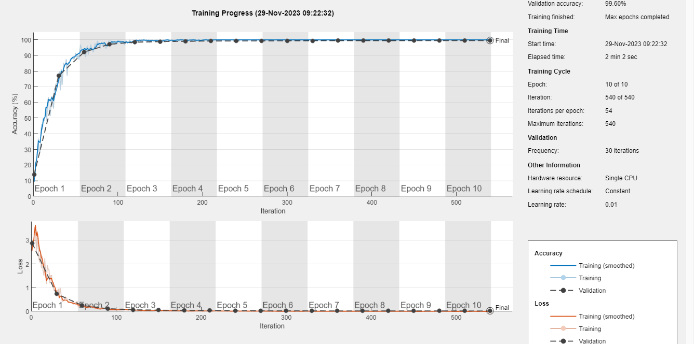
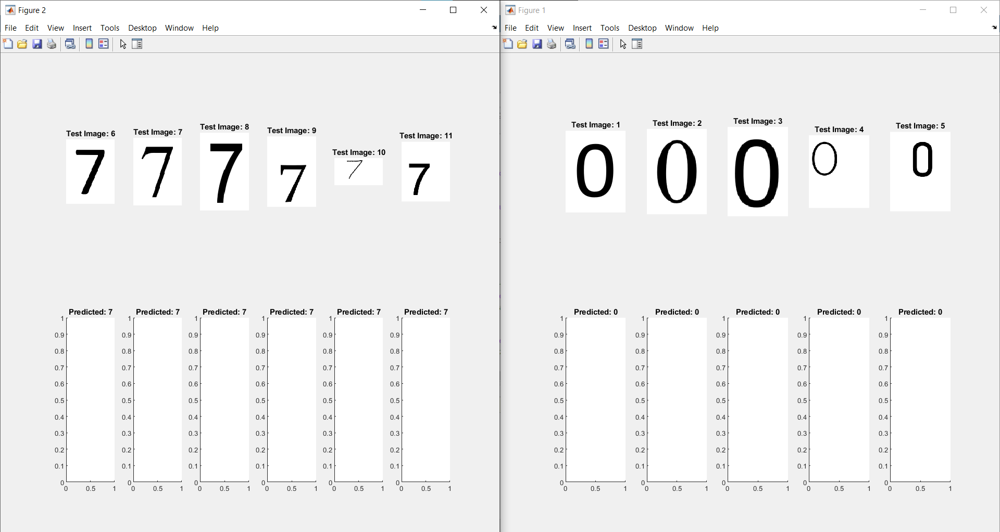

# Assignment 2 - the convolutional neural network and number recognition

The main goals were to train a convolutional neural network to accurately recognize digits, create and preprocess a training dataset using imageDatastore, and ensure correct identification of the digits '0' and '7'.

## The training graphs

## The example output

